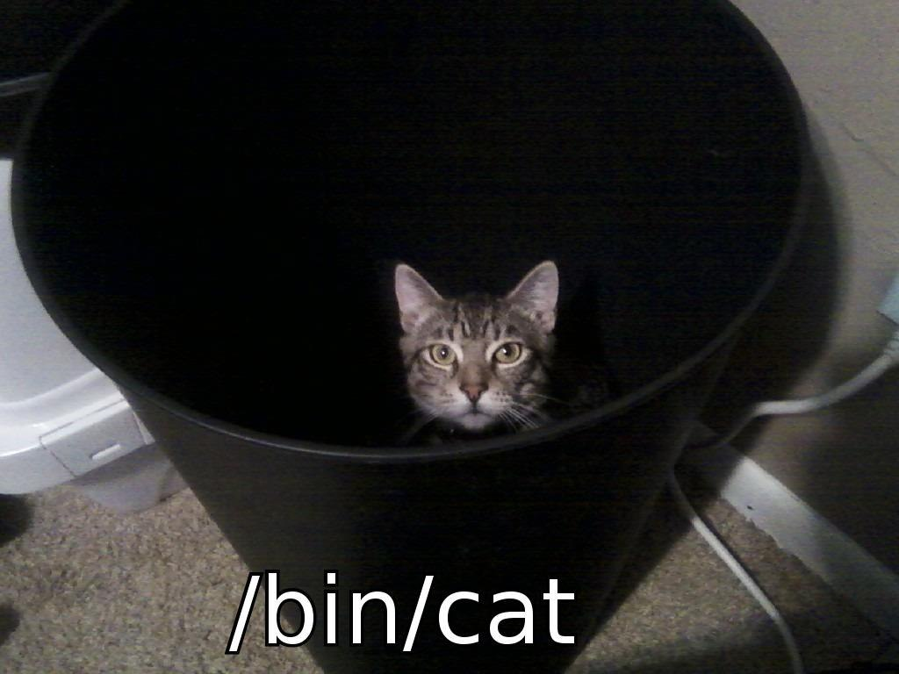

# discord.spwn
An API wrapper for Discord, written in [SPWN](https://github.com/Spu7Nix/SPWN-language).

## Entirely Implemented
- [X] Audit
- [ ] Channel
- [ ] Client
- [X] Emoji
- [ ] Guild
- [X] Invite
- [X] Stage
- [X] Sticker
- [ ] User
- [X] Webhook
- [ ] Components
- [ ] Commands
- [ ] Ease of use

## FAQ
Q:What you can do? 
A:Anything 

Q:What you can't do?  
A:Everything

